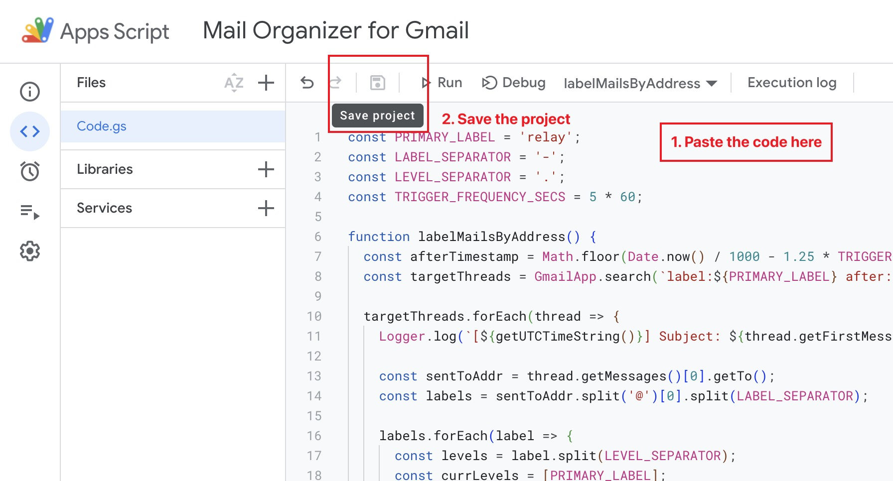

# Mail Organizer for Gmail

A simple [Google Apps Script](https://script.google.com/) that help you organize mails according to email addresses.

This project is inspired by [0x4447/0x4447_product_s3_email](https://github.com/0x4447/0x4447_product_s3_email).

## What does it do?

The script labels emails accoding to the address the email was sent to. This **requires** you to own a domain name to proceed.

For example, you own the domain name `example.com`, and you set up an email forwarding service such as [Forward Email](https://forwardemail.net/) or [ImprovMX](https://improvmx.com/) to relay all emails sent to `*@relay.example.com` to your Gmail account.

The script will label your emails according to a set of rules. For example:

| Sent to address | labels |
|---|---|
| `hello@relay.example.com` | `hello` |
| `hello-world@relay.example.com` | `hello` and `world` |
| `hello.world@relay.example.com` | `hello/world` (`world` as a sublabel of `hello`) |
| `hello.world-yo.wassup@relay.example.com`| `hello/world` and `yo/wassup` |

And, of course, you can easily customize the label separator (`-`) and the level separator (`.`).

## Usage

1. **Set up your email forwarding service** (i.e. [Forward Email](https://forwardemail.net/) or [ImprovMX](https://improvmx.com/)). Suppose the email forwarding domain of your choice is `relay.example.com`. You should set up a catch-all rule that forwards all emails sent to any `@relay.example.com` addresses to your Gmail.

2. **Create a Gmail filter.** Go to your Gmail settings → `Filter and Blocked Addresses` → `Create a new filter`. Create a filter that applies emails sent to `*@relay.example.com` with a label of your choice. (Default label name: `relay`)

    

    
Screenshots

    
    

    

3. **Create a Google Apps Script project** at https://script.google.com/. Copy all contents from [./Code.gs](./Code.gs) of this project and paste to `Code.gs` of your Google Apps Script project, and then save the project.

    

    
Screenshot

    

    

4. **Create 2 triggers in the `Triggers` tab.** To add a trigger, click `Add Trigger` button in the bottom-right corner of the page. Here's a configuration of the two triggers for the two functions respectively (you can also reference the screenshots provided):

    | Choose which function to run | `labelMailsByAddress` | `deleteUnusedLabels` |
    |---|---|---|
    | Choose which deployment should run | Head | Head |
    | Select event source | Time-driven | Time-driven |
    | Select type of time based trigger | Minutes Timer | Hour Timer |
    | Select interval | Every 5 minutes (if you wanna customize this, see [Customization](#customization)) | Every hour |

    > [!NOTE]
    > For Apps Scripts, Google has set a time limit. As of now, the limit is 6 mins per execution and 90 mins per day ([source](https://developers.google.com/apps-script/guides/services/quotas)). This script has been optimized to avoid running over time limit. Adjust the time interval accordingly if you have a lot of emails and got errors like "User-rate limit exceeded", or if you feel like the interval is too long for you.

    

    
Screenshot

    
    
    

    

5. **Done!** Enjoy using the script!

## Customization

You can simply customize the script by modifying the 4 constants at the very top of the script.

1. `PRIMARY_LABEL`: if you name your label differently in step 2 (not `relay`), change the value accordingly.
2. `LABEL_SEPARATOR` and `LEVEL_SEPARATOR`: if you want to use different symbols to separate the labels or sublabels in your email address, change the values according. Remember to only choose from [allowed symbols](https://en.wikipedia.org/wiki/Email_address#Local-part) for the local part of an email address.
3. `TRIGGER_FREQUENCY_SECS`: if you set a different trigger interval for function `labelMailsByAddress`, change it accordingly. Note that the unit here is second.

## License

[MIT](./LICENSE) &copy; Ning Kuang, 2023.
